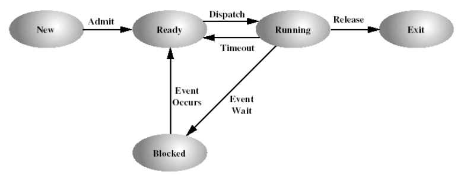
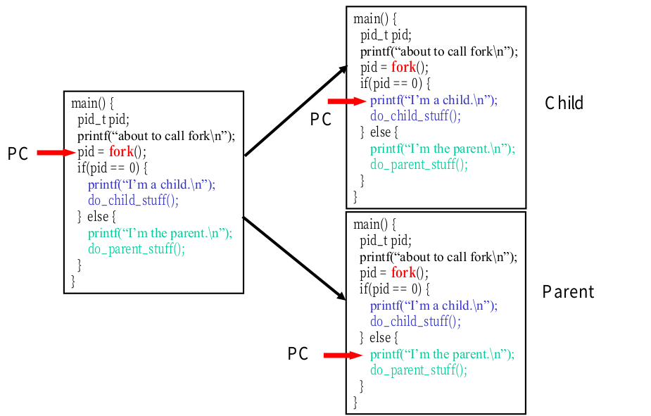
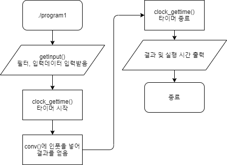
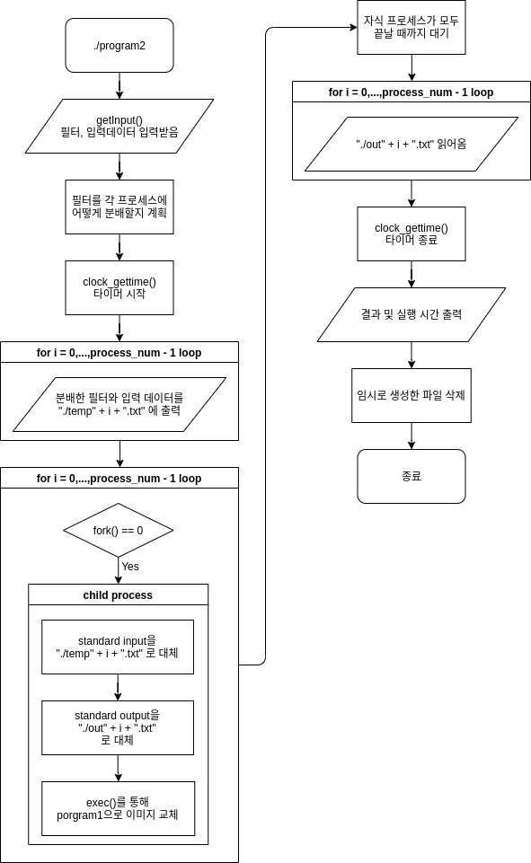
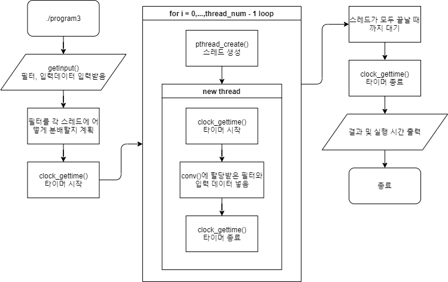
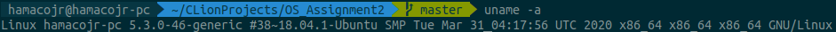
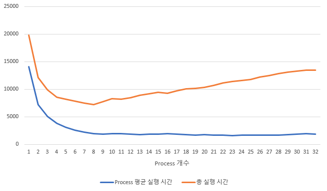
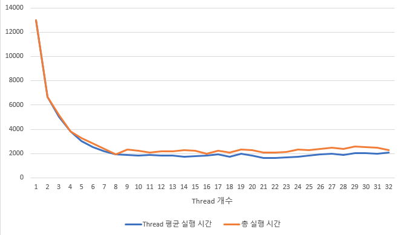
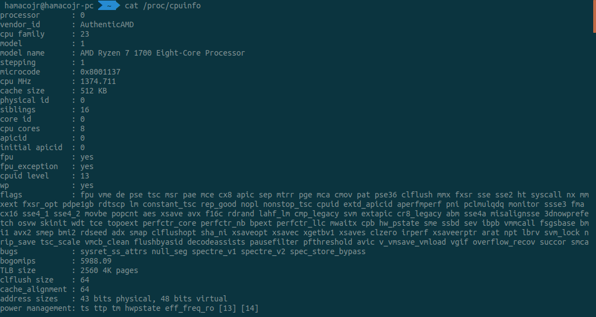
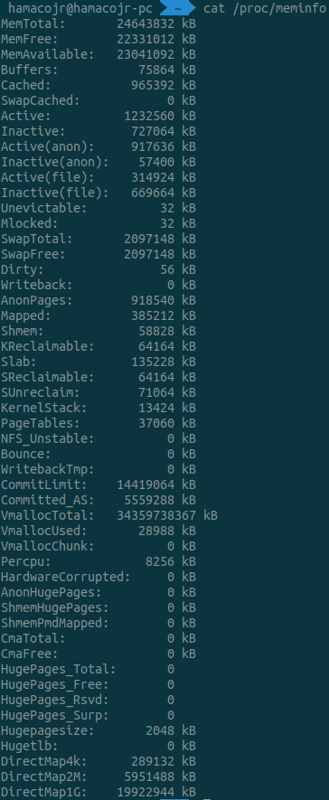

# Operating System Assignment 2

`조석주 2018147580`

[TOC]


## 사전 조사 보고서

### 프로세스와 스레드

#### 프로세스

프로세스는 실행중인 프로그램이다. 하나의 프로세스는 다음과 같은 구조로 이루어져 있다.

- Images
  - Code(text): 프로그램의 명령어
  - Data
    - Initialized data segment: 초기화 되어있는 전역변수
    - Uninitialized data segment: 초기화 되어있지 않은 전역변수. 커널에 의해 0으로 초기화된다
  - Stack: 함수 호출을 위한 메모리 공간
  - Heap: 동적 할당을 위한 메모리 공간
- Process context
  - Program context: PC, SP, data register등 프로그램 실행을 위한 CPU 내의 값
  - Kernel context: 커널이 프로세스를 관리하기 위한 구체적인 내용

위 데이터들을 관리하는 자료구조를 PCB (Process Control Block) 이라고 하고, 각 프로세스마다 하나의 PCB 인스턴스가 존재한다. 운영체제가 보조기억장치로부터 프로그램을 읽어와 주메모리에 하나의 PCB로 초기화 되었다면, 그것을 프로세스라고 한다.

##### 프로세스의 상태

프로세스는 운영체제에 의해 관리되며 실행되는 동안 상태가 바뀌게 된다. 일반적으로 프로세스의 상태는 다음과 같이 정의한다.

- new: 프로그램이 프로세스로 만들어지는 과정
- ready: 프로세서에 할당되기를 기다리고 있는 상태
- running: 명령어가 실행되고 있는 상태. CPU는 scheduler에 의해 프로세스를 할당받게 된다.
- blocked (or waiting): 이벤트를 기다리고 있는 상태 (e.g. I/O Interrupt). 시간이 오래걸리는 I/O 작업 등이 진행되는 동안 CPU는 ready queue에서 다른 프로세스를 dispatch해 실행한다.
- exit (or terminated): 프로세스가 끝난 상태



**참고문헌**

강의 슬라이드

##### 프로세스의 구현

리눅스에서는 위 설명한 이미지, Kernel context, Program context를 `task_struct` 자료구조에 저장한다. `task_struct` 내부에서는 `struct mm_struct *mm` 에 Task Image의 메모리 주소를 담고, `struct thread_struct thread` 에 Program context의 메모리 주소를 담는다. 이외의 field는 전부 Kernel context의 내용을 담고있다.

##### 멀티 프로세스

병렬로 처리해 성능을 높이고 싶은 작업이 있다면, 프로세스는 여러개의 Child process를 생성해 작업을 여러개의 프로세서에서 동시에 실행할 수 있다. 이와 같은 작업을 멀티 프로세스라고 한다.

##### 멀티 프로세스의 구현

리눅스의 프로세스를 위한 시스템 콜은 다음과 같다.

- `fork()`

  리눅스에서는 `fork()` 시스템 콜을 이용해 data, heap, stack의 내용이 동일한 프로세스를 생성한다. `fork()`는 parent에서는 생성된 프로세스의 pid를 리턴하고, child process에서는 `0`을 리턴한다.

- `exec()` family
  
  - 프로세스를 새로운 프로세스로 바꾼다.
- `wait()`
  - 기본적인 동기화 기능이다.
  - Child process 가 종료할 때까지 대기한다.
- `exit()`
  
  - 프로세스를 종료한다.



위 그림과 같이, `fork()`의 결과가 `0`이라면 child process의 작업을 수행하고, `0`이 아니라면 parent의 작업을 수행하는 방식으로 멀티 프로세스를 구현한다.

**참고문헌**

강의 슬라이드

##### IPC (Inter-Process Communication)

여러개의 프로세스가 서로 통신을 하기 위해서는 커널이 제공하는 IPC를 통해 통신해야한다. UNIX에서 제공하는 IPC는 다음과 같다.

- Pipe
- FIFO
- Message passing
- Semaphore
- Shared Memory
- Socket

#### 스레드

위에서 프로세스를 살펴보았다. 많은 프로그램들은 fork()를 이용해 여러개의 프로세스를 생성해 병렬로 처리하려고 한다. 하지만 이와 같은 접근에는 몇가지 단점이 있는데,

1. 프로세스는 많은 정보를 담고있어 무겁다. (Image + process context)
2. `fork()`는 프로세스를 전부 복사하기 때문에 프로세스 생성에 큰 비용이 든다.
3. IPC (Inter-Process Communication)는 커널을 거쳐 작동하기 때문에 비용이 높다.
4. 여러개의 프로세스가 공유할 수 있는 데이터임에도 불구하고 `fork()`는 프로세스의 모든 데이터를 복사한다.

이와 같은 문제점을 해결한 모델이 스레드 모델이다. 스레드는 프로세스에서 공유할 수 있는 부분을 서로 공유해 불필요한 복사가 일어나지 않게 하고, 여러개의 CPU를 하나의 code 영역에서 작동시킨다. 스레드는 다음과 같은 데이터를 공유한다.

- Text 영역
- Data 영역
- Shared library
- Kernel context

하지만, 여러개의 CPU에서 동시에 동작하기 위해서 다음과 같은 데이터는 공유할 수 없다.

- User stack
- Thread context(PC, SP, Data register)

프로세스의 공유할 수 없는 영역을 스레드로 정의하게 된다.

스레드의 이점은 다음과 같다.

1. 병렬 처리의 비용이 적다.
2. 생성, 종료, Context switching을 짧은 시간에 할 수 있다.
3. 한 프로세스 내의 스레드들은 data, heap 영역을 공유해 커널을 거치지 않고 통신할 수 있다.
4. 반응성이 높다.
5. 멀티 프로세서 아키텍처를 이용할 수 있다.

##### 스레드의 구현

스레드의 구현 모델에는 다음과 같이 두가지가 있다.

1. Kernel-level threads: 운영체제에서 스레드를 관리한다.
   - 별개의 CPU에서 여러개의 스레드를 동시에 실행할 수 있다.
   - Blocking system call을 한 스레드에서 호출하더라도, 다른 스레드에 영향을 주지 않는다.
2. User-level threads: 운영체제는 스레드를 인식할 수 없고, 프로그램이 직접 스레드를 관리한다.
   - I/O 작업을 한 스레드에서 요청시 모든 스레드가 중지된다.
   - 멀티 프로세서를 지원하지 않아 성능적 이점이 없다.

리눅스에서는 Kernel-level threads를 채택하고 있고, lightweight processes를 제공해 thread를 구현한다. 리눅스는 thread와 process를 구분하지 않고 task로 통합해 관리한다.

##### 멀티 스레드

프로세스 하나에서는 여러개의 스레드를 생성할 수 있다. 스레드 여러개를 하나의 프로세스에서 만들어 무거운 프로세스를 여러개 만들지 않아도 병렬로 코드를 실행할 수 있게 한다. 이와 같이 작업을 스레드로 나눠 여러개의 프로세서에서 실행하는 것을 멀티 스레드라고 한다.

##### 멀티 스레드의 구현

- `int pthread_create(pthread_t *tid, pthread_attr_t *attr, void *(start_routine)(void *), void *arg);`

  pthread를 생성하여 생성된 pthread에 대한 핸들을 `tid`에 저장한다. pthread의 main funtion은 세번째 인자인 `start_routine`이 되며, `arg`를 함수의 인자로 넘겨준다.

- `void pthread_exit(void *retval);`

  pthread를 종료한다.

- `int pthread_join(pthread_t tid, void **thread_return);`

  생성된 pthread가 종료되기를 기다린다. `pthread_exit`의 인자를 `thread_return`으로 전달 받는다.

#### 프로세스와 스레드의 차이점

1. 프로세스는 각각 독립적인 메모리 영역을 갖는다. 스레드는 text와 heap, data영역을 공유한다.

2. 프로세스는 IPC를 이용해 통신해 비용이 크고, 반응이 느리다. 하지만, 스레드는 같은 프로세스를 공유하므로, data 및 heap 영역으로 kernel을 거치지 않고 통신 가능해 상대적으로 적은 비용으로 데이터를 주고 받을 수 있다.

3. 프로세스의 생성, 스위칭, 종료는 스레드보다 더 느리다.
4. 프로세스는 하나의 프로세스에서 생긴 문제가 다른 프로세스에 주는 영향이 상대적으로 적다. 반면, 스레드는 하나의 스레드에서 문제가 생기면 다른 스레드까지 큰 영향을 줄 수 있다.

### exec 계열의 시스템 콜

#### exec 시스템 콜이란

리눅스에서 프로세스를 생성하는 유일한 방법은 `fork()`이다. 하지만 이 함수는 자신을 복사하기만 할 뿐, 새로운 프로그램의 프로세스를 생성할 수 없다. 따라서, 새로운 프로그램을 실행하기 위해 `fork()`를 통해 자식 프로세스를 생성한 후 `exec()`를 통해 Image의 내용을 새로운 프로그램으로 바꾸게 된다.

#### exec 계열 함수의 종류

unistd.h에 정의된 POSIX standard를 따르는 exec계열의 함수는 다음과 같다.

`int execl(char const *path, char const *arg0, ...);`

`int execle(char const *path, char const *arg0, ..., char const * const *envp);`

`int execlp(char const *file, char const *arg0, ...);`

`int execv(char const *path, char const * const * argv);`

`int execve(char const *path, char const * const *argv, char const * const *envp);`

`int execvp(char const *file, char const * const *argv);`

##### 함수 이름의 규칙

| keyword | 내용                                                         |
| ------- | ------------------------------------------------------------ |
| e       | 환경변수에 대한 포인터 배열을 새로운 프로세스 이미지에 전달한다. |
| l       | Command-line arguments가 함수에 명시적으로 전달된다.         |
| p       | `file` 이 환경변수 PATH에 있는 명령인지 확인한다.            |
| v       | Command-line arguments가 함수에 포인터 배열로 전달된다       |

**참고문헌**

C Programming/POSIX Reference/unistd.h/exec . (2017). https://en.wikibooks.org/wiki/C_Programming/POSIX_Reference/unistd.h/exec.

---

## 프로그래밍 수행 결과 보고서

### 프로그램의 동작 과정 및 구현

#### 프로그램 개요

| File name  | Description                       |
| ---------- | --------------------------------- |
| program1.c | Single process, single thread     |
| program2.c | Multi process                     |
| program3.c | Multi threads                     |
| conv.c     | Convolutional Layer, ReLU         |
| io.c       | 입출력 관련 함수                  |
| structs.c  | Pixel, Image의 struct와 관련 함수 |
| time.c     | 시간 측정 관련 함수               |
| const.h    | 상수, 매크로 정의                 |

- Figure of structs


위 그림은 `structs.c`에 정의된 구조체에 대한 도식이다. 사용자가 입력하는 각 필터, 입력 이미지는 모두 `Image`  구조체에 저장되고, 각 `Image` 구조체는 `Pixel` 의 2차원 배열의 포인터와 이미지의 height, width를 가지고 있다.

- Program1 Flowchart



필터, 입력 데이터를 받아 convolutional layer, ReLU를 적용한 결과를 출력하는 프로그램으로, 아주 단순한 구조로 이루어져 있다.

```c
getInput(&input, &filters, &filter_num); //필터, 입력 데이터을 입력받음
```

`io.c` 에 정의된 함수를 이용해 사용자에게 입력을 받고,

```c
for (int i = 0; i < filter_num; i++) {
    conv(input, &filters[i], &results[i]);
    //convolution layer에 인풋을 넣어 결과를 얻음
}
```

`conv.c` 에 정의된 함수 `conv()`로 주어진 필터, 입력데이터로 결과를 계산한다.

```c
for (int i = 0; i < filter_num; i++) {
	if (!DEBUG) printResult(&results[i]);
}
```

또한, `printResult()` 로 결과를 출력한다.

- Program2 Flowchart



Program2는 자식 프로세스에게 필터를 적절히 분배하여 병렬로 계산하는 멀티 프로세스 구조를 가지고 있다. Program1보다 상대적으로 복잡한 구조를 가지고 있고, 그중 부모 프로세스와 자식 프로세스가 데이터를 주고 받고 동기화 하는 과정이 가장 중요하다.

```c
for (int process_index = 0; process_index < process_num; process_index++) {
    if (fork() == 0) { //새로운 프로세스 생성
        char f_in[BUF_SIZE];
        char f_out[BUF_SIZE];
        sprintf(f_in, "./temp%d.txt", process_index);
        sprintf(f_out, "./out%d.txt", process_index);
        int in = open(f_in, O_RDONLY);
        int out = open(f_out, O_WRONLY | O_TRUNC | O_CREAT, S_IRUSR | S_IRGRP | S_IWGRP | S_IWUSR);
        dup2(in, 0); //각 프로세스의 standard input을 파일로 대체
        dup2(out, 1); //각 프로세스의 standard ouptut을 파일로 대체
        close(in);
        close(out);
        if (execl("program1", NULL) == -1) {
            perror("error in execl");
        }
        //program1 실행
        exit(0);
    } //자식 프로세스가 실행
}
```

위는 자식 프로세스를 생성하고 부모와 자식 프로세스 간의 통신을 설정하는 코드이다. `fork() ` 시스템 콜을 통해 프로세스를 생성하고, 리턴 값이 `0` 이라면 자식 프로세스의 코드를 실행한다. `temp*.txt`를 standard input으로, `out*.txt`를 standard output으로 `dup2()` 함수를 통해 리디렉트한다. 그리고 자식 프로세스를 `execl()` 함수를 통해 program1으로 교체해 각 프로세스에 할당된 계산을 수행한다.

```c
for (int i = 0; i < process_num; i++) {
    wait(NULL);
}
```

이후 모든 프로세스의 작업이 완료되는 것을 기다리기 위해 `wait()` 시스템 콜을 생성한 프로세스 개수만큼 호출한다. 모든 자식 프로세스가 종료되었다면, 각 프로세스가 출력한 `out*.txt`를 읽어와 입력으로 주어진 필터 입력 순서대로 결과를 출력한다.

- Program3 Flowchart



Program3은 적절히 분배한 필터를 여러 스레드에서 실행하는 멀티 스레드 구조를 가지고 있다.

```c
Image *input, *filters, *results; //입력 데이터, 필터, 결과를 저장
int filter_num, thread_num; //필터, 스레드의 개수
int *thread_assign_table;
```

각 스레드들은 위와 같은 전역변수를 통해 통신하여, 커널을 거치고 파일을 통해 통신하는 program2에 비해 큰 성능 향상을 기대할 수 있다. 전역변수에 선언된 포인터에는 동적할당한 힙 영역의 메모리 주소를 저장한다.

```c
for (int i = 0; i < thread_num; i++) {
    thread_index_table[i] = i;
    pthread_create(&p_thread[i], NULL, convThread, (void *) &thread_index_table[i]);
}
```

`pthread_create()` 함수를 통해 스레드를 생성하고, 각 스레드는 `convThread()` 함수를 실행한다. 각 스레드에서는 할당받은 필터와 입력 데이터를 `conv()`에 넣어 계산한 후, 결과를 힙에 저장한다.

```c
for (int i = 0; i < thread_num; i++) {
    long thread_time;
    pthread_join(p_thread[i], (void **) &thread_time); //스레드 종료까지 대기
    thread_time_table[i] = thread_time; //스레드 실행 시간을 저장
}
```

위는 생성한 스레드들을 동기화하는 과정이다. `pthread_join()`으로 모든 스레드가 종료될 때 까지  대기한 후, 각 스레드에게 할당한 함수의 리턴값(여기서는 각 스레드의 실행 시간)을 저장한다. 이후 결과 및 실행시간을 출력한 후 종료한다.

### Makefile

```makefile
CC=gcc
CFLAGS=-pthread
OBJS=structs.o io.o conv.o time.o

all: program1 program2 program3

program1: program1.o $(OBJS)
	$(CC) -o $@ $^ $(CFLAGS)
program2: program2.o $(OBJS)
	$(CC) -o $@ $^ $(CFLAGS)
program3: program3.o $(OBJS)
	$(CC) -o $@ $^ $(CFLAGS)

%.o: %.c
	$(CC) -c -o $@ $<

clean:
	rm -f program1 program2 program3 *.o
```

위는 작성한 세 프로그램을 한번에 컴파일 하기 위한 Makefile 내용이다.

#### Makefile의 구성

Makefile은 다음과 같이 구성되어있다.

`Macro` = Value

`Target`: `Dependencies`

​	`Command`

- Macro: 코드 중간에 나타나는 Macro를 Value로 치환해준다.
- Target: 빌드 대상의 이름. 일반적으로 최종적으로 생성되는 파일 이름을 쓴다.
- Dependencies: 빌드 대상이 의존하는 Target 목록. 여기에 나열된 대상을 우선적으로 만든다.
- Command: 빌드 대상을 생성하는 명령

`make` 명령을 실행하게 되면, 가장 상단에 있는 타겟을 생성하게 된다. 위 코드에서는 `all`을 실행하여 세개의 프로그램을 모두 빌드한다. 컴파일러는 `CC`에 gcc로 명시해 두었고, 세 프로그램이 공통적으로 의존하는 오브젝트 파일은 `OBJS`로 묶어두었다. `pthread`를 이용하기 위한 컴파일러 옵션은 `CFLAGS`에 넣어 두었다.


코드 하단을 보면 다음과 같은 내부 매크로를 사용한다.

- `$@` : 현재 타겟의 이름
- `$^ ` : 현재 타겟의 종속 항목 리스트

```makefile
%.o: %.c
	$(CC) -c -o $@ $<
```

 위 코드를 살펴보자.  `.o` 확장자를 갖는 모든 Target은 같은 이름의 `.c` 파일을 의존한다. 또한, `$(CC)`에 등록해둔 컴파일러를 이용해 종속 항목 리스트에 있는 C 소스를 컴파일해 Target과 같은 이름의 오브젝트 파일을 생성한다.


```makefile
clean:
	rm -f program1 program2 program3 *.o
```

더미타겟인 `clean`은 빌드 결과 생성된 파일들을 지우는 역할을 한다.  `make clean` 명령을 통해 실행할 수 있다.

**참고문헌**

make와 Makefile. (2016. 3. 14. 01:05). https://bowbowbow.tistory.com/12#make-%EC%99%80-makefile.

### 개발 환경

#### uname 실행 결과



#### PC 환경

| Component   | Spec                                   |
| :---------- | -------------------------------------- |
| CPU         | *AMD Ryzen 7 1700 Eight-Core Processor |
| RAM         | *24GB                                  |
| GCC version | 7.5.0                                  |
| IDE         | CLion 2020.1                           |

결과 분석의 수월함을 위해 CPU의 SMT 기능을 꺼놓았다.

*Appendix 참조

 ### 문제 상황 및 해결 방법

#### Program3의 실행 시간이 크게 나오는 문제

Program3의 총 실행시간이 크게 측정되서 같은 입력 데이터에서 program1의 실행시간보다 크게 나오는 문제가 있었다. 이는 시간 측정 수단의 문제였다. 이전에는 `clock()` 함수를 사용하여 시간을 측정하였지만, 이는 멀티스레딩 프로그램의 시간 측정에 문제가 있다. `clock()`함수는 wall clock time을 측정하는 것이 아닌, 여러개의 스레드에서 소요된 총 CPU 사용시간을 측정한다. 이를 해결하기 위해 `clock_gettime()` 함수를 사용하였다.

**참고문헌**

measuring time of multi-threading program . (2011). https://stackoverflow.com/questions/7918529/measuring-time-of-multi-threading-program.

### 결과

#### 입력 데이터 메타 정보

| Constant                | Value |
| ----------------------- | ----- |
| 필터 개수               | 32    |
| 필터 row 개수           | 5     |
| 필터 column 개수        | 5     |
| 입력 데이터 row 개수    | 1000  |
| 입력 데이터 column 개수 | 1000  |

**아래 수행시간은 전부 출력에 걸리는 시간을 제외한 결과입니다.**

#### Program1 실행 결과

| 실행시간 (ms) |
| ------------- |
| 13643         |

#### Program2 실행 결과

입력 데이터를 그대로 유지하면서 Process 개수를 32까지 늘리면서 시간을 측정하였다. 단위는 밀리 초(ms)이다.



#### Program3 실행 결과

입력 데이터를 그대로 유지하면서 Thread 개수를 32까지 늘리면서 시간을 측정하였다. 단위는 밀리 초(ms) 이다.



#### 결과 분석

Program2 실행 결과의 특징을 살펴보자.

- Process 평균 실행시간과 총 실행시간의 차이가 두드러진다.

  이는 program2가 program1에게 데이터를 전달하는 방식이 원인이다. Program2는 필터를 적절히 나누어 program1에게 전송할 데이터를 파일로 만들어 전송한다. 이는 속도가 아주 느린 보조저장장치를 통해 통신하는 것이므로, 속도가 확연하게 느려지게 된다.

- 총 실행 시간이 8개까지 감소하다가 프로세스의 수가 늘어남에 따라 선형적으로 증가한다.

  이는 program1을 위한 데이터를 만드는 과정에서 프로세스의 개수만큼 데이터가 중복되게 생성되기 때문이다. 즉, 필터 뿐만이 아니라 입력의 대부분을 차지하는 입력 데이터가 프로세스 개수만큼 파일로 작성되기 때문이다. 입력 데이터의 용량은 대략 10MB 정도로, 입력 데이터를 보조기억장치에 쓰는데 많은 시간을 소비하게 된다. 프로세스 개수만큼 파일을 만들어 작성하게 되므로, 프로세스가 증가함에 따라 중복된 내용을 쓰는데 걸리는 비용이 크게 증가하게 된다.

- Process 평균 실행시간이 8개에서부터 감소하지 않는다.

  프로세서의 코어가 8개이므로, 프로세스 8개까지 평균 실행시간이 줄어드는 것은 자명해 보인다. 하지만, 필터의 개수가 32개이므로, 프로세스의 개수가 늘어남에 따라 프로세스 하나당 할당받는 필터의 개수가 줄어들어 평균 실행시간도 줄어들어야 한다. 그렇지 않은 이유는 무엇일까? 이는 시간 측정 방법에 따른 결과이다. **문제상황 및 해결방법**에서 언급했듯이, `clock_gettime()` 은 프로그램의 실행시간이 아닌, wall clock time을 측정한다. 즉, program1이 ready queue에 있을 때에도 시간을 측정한다. OS의 스케쥴링에 따라서 시간이 크게 측정될 수 있는것이다. 또한, 프로세스의 개수가 늘어남에 따라 context switching의 횟수도 늘어나게 된다. 이 또한 시간이 줄지 않은 원인이다.

Program3 실행결과의 특징은 다음과 같다.

- Thread 평균 실행시간과 총 실행시간이 거의 일치한다.

  Program2 와의 차이가 드러나는 부분이다. program2와 달리, 커널을 거치지 않고 힙 영역을 공유해 통신하게 된다. 이는 보조저장장치를 거쳐 통신하고, 커널의 도움을 받아야하는 program2와 큰 차이가 나는 원인이다.

- 총 실행시간이 8개까지 감소하다가 일정하게 유지된다.

  이 또한, program2와의 차이가 드러난다. 입력 데이터를 중복되게 생성하는 program2와 달리 힙을 통해 입력 데이터를 공유해 불필요한 복사가 일어나지 않는다.

- Thread 평균 실행시간이 8개에서부터 감소하지 않는다.

  Program2의 경우와 유사한 이유이다. 스레드의 개수가 늘어남에 따라 context switching의 횟수가 증가하여 시간이 줄지 않는다.

#### 3개 프로그램의 종합적인 비교

Program2, Program3의 최고 기록인 process 8개, thread 8개 일때를 기준으로 비교해 보자.

| 프로그램 | 실행 시간 (ms) |
| -------- | -------------- |
| Program1 | 13643          |
| Program2 | 7247           |
| Program3 | 1935           |

Program3 > Program2 > Program1 순서로 좋은 성능을 보여준다. 여러개의 필터를 나누어 여러 CPU에서 동시에 실행함으로써 program1에 비해 program2, program3에서 큰 성능 향상을 얻었다. 또한 program2가 자식 프로세스에게 데이터를 파일로 전달하기 때문에 힙을 통해 데이터를 공유하는 program3 보다 크게 낮은 성능을 보인다.

#### 싱글코어 vs. 멀티코어

다음은, 세개의 프로그램을 싱글코어 및 멀티코어 (8 코어)에서 실행한 결과이다. 하나의 코어를 제외하고 모두 비활성화 하는 방법을 사용하였다. program2, program3에서 process 8개, thread 8개를 생성하였다.

| program  | 싱글코어 실행 시간 (ms) | 멀티코어 (8 코어) 실행 시간 (ms) |
| -------- | ----------------------- | -------------------------------- |
| Program1 | 13274                   | 13643                            |
| Program2 | 21534                   | 7247                             |
| Program3 | 13054                   | 1935                             |

싱글 코어로 작동할 때를 살펴보자. Program2는 program1에게 전달해줄 입력 파일을 8개 생성하고, program1도 결과를 8개의 파일에 저장한다. 결과를 파일로 주고받는 과정에서 발생하는 오버헤드로 인해 하나의 프로세스로 작동할 때보다 시간이 크게 증가하였다. Program3은 program2와 비교해 오버헤드가 매우 작지만, 멀티 프로세서로 인한 이점이 사라져 program1과 비슷한 결과를 보인다. 싱글코어의 경우와 멀티코어의 경우를 비교해보면, 싱글코어에서 멀티 프로세스, 멀티 스레드로 인한 시간적 이득은 없다는 사실을 알 수 있다.

## Appendix

- `cpuinfo`



- `meminfo`

