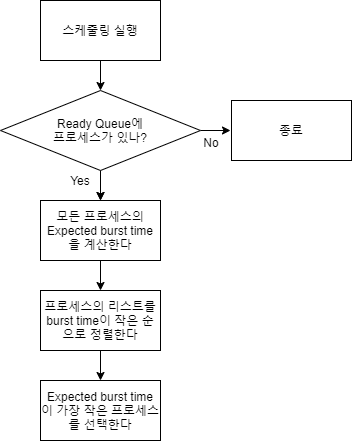

# Operating System Assignment 3

`2018147580 조석주`

[TOC]


### 프로그램 개요

다양한 스케줄러 알고리즘과 페이지 교체 알고리즘을 시뮬레이팅하는 프로그램이다. 

#### Scheduling Algorithms

스케줄러는 매 사이클마다 실행되어 실행할 프로세스를 선택하고, 종료한다.

1. FCFS

   스케줄러는 ready queue에서 가장 오래동안 머문 프로세스를 선택한다. 

   

2. Round Robin

   FCFS와 같은 방식으로 프로세스를 선택하되, time quantum이 있어 하나의 프로세스는 time slice를 모두 사용했을 때 ready queue의 끝으로 돌아간다. 이 프로그램에서의 time quantum은 10 cycle이다.

   

3. Preemptive Shortest Job First

   스케줄러는 예상되는 CPU burst time이 가장 짧은 프로세스를 선택한다. 하지만, CPU burst time은 정확히 알기 어려우므로, burst time을 예측하는 방식이 두가지 있다.

   1. Simple Averaging

      이전까지의 burst time을 평균한 값을 예상 값으로 사용한다.

   2. Exponential Averaging

      CPU burst를 exponential averaging으로 계산해 예전의 burst time보다 최근의 burst time을 더 크게 반영한다.

   Preemptive하므로, 실행중인 프로세스보다 예상 burst time이 적은 프로세스가 생성된다면, 그 프로세스를 실행한다.

   

   

#### Page Replacement Algorithms

1. FIFO

   먼저 할당된 페이지를 가장 먼저 해제하는 방법이다. 스택을 생성해 새로운 페이지가 물리 메모리에 할당될 때 마다 Queue에 push한다. 만약 물리 메모리에 요청받은 페이지를 할당할 수 없어 기존 페이지를 해제해야 한다면, 가장 먼저 들어온 페이지를 반복적으로 해제한다. 

   

2. Least Recently Used

   가장 오래동안 쓰이지 않은 페이지를 먼저 제거하는 방법이다. 페이지에 접근할 때마다 그 페이지를 Stack의 top으로 옮기고, 물리 메모리가 꽉차 페이지를 해제해야할 때에는 Stack의 바닥에 있는 페이지를 해제한다.

   

3. Least Recently Used - Sampled

   LRU와 같이 모든 페이지에 대해 정확하게 페이지가 언제 쓰였는지 기록하기에는 오버헤드가 너무 크기에, LRU와 비슷하게 동작하면서 오버헤드는 더 적은 알고리즘이다.  각 페이지마다 reference bit과 reference byte를 보관하는데, Access가 이뤄질 때마다 reference bit을 0으로 만든다. 8번째 명령어마다 인터럽트가 발생해 reference byte를 shift right하고, MSB를 reference bit으로 채운후 reference bit은 0으로 초기화한다.

   

4. Least Frequently Used

   각 페이지마다 몇번 Access가 되었는지 저장하는 Count를 유지한다. 물리 메모리에 요청받은 메모리를 할당할 수 없을 경우 Count가 가장 작은 페이지를 해제한다.

   

5. Most Frequently Used

   위와 마찬가지로, 각 페이지마다 몇번 Access가 되었는지 저장하는 Count를 유지한다. 물리 메모리에 요청받은 메모리를 할당할 수 없을 경우 Count가 가장 큰 페이지를 해제한다.

   

6. Optimal Algorithm

   앞으로 가장 오랫동안 사용되지 않을 페이지를 선택해서 교체한다. 이를 위해서, 프로그램이 돌아가기 전에 스케줄러를 처음부터 끝까지 돌려 Access가 언제 발생하는지 전부 저장한다.

   

#### Buddy System

Buddy System은 `PhysicalMemory` 클래스에 이진트리를 이용해 구현하였고, 클래스는 Initialization, Allocation, Release의 연산을 할 수 있다. 

이진트리에서 루트 노드는 물리메모리의 전체를 , 루트노드의 왼쪽 자식은 메모리의 아래쪽 절반, 오른쪽 자식은 위쪽 절반을 대변한다. 이를 확장해서, 어떤 노드의 왼쪽 자식은 부모노드의 아래쪽 절반 프레임, 오른쪽 자식은 위쪽 절반 프레임을 의미한다. 이런식으로 재귀를 통해 Buddy System에 페이지가 할당되는 것을 효율적으로 표현할 수 있다. Buddy System과 이진트리에 내재된 구조적 유사성을 이용해, 모든 연산은 재귀를 통해 이진트리를 중위 순회하여 구현한다.


위는 Buddy System을 이진트리를 이용하여 도식화한 것이다. 같은 부모를 갖고있는 노드들은 서로 Buddy이다. 파란색 노드는 부모노드의 아래쪽 절반, 빨간색 노드는 부모노드의 오른쪽 절반을 의미한다.

다음은 주요 연산의 pseudo code이다. 

- Initialization

  트리를 생성하고, 루트 노드의 포인터를 반환한다. 각 노드들은 depth에 따라 자신이 메모리에서 차지하는 용량, 즉 프레임의 개수가 결정된다. 

  ```c++
  Node *Initialization(int depth) {
      Node *n <= new Node();
      n->size <= 2 ^ depth
      // 노드를 생성하고, 각 노드에 맞는 프레임의 개수를 부여한다
  
      if (depth == 0) {
          n->leaf <= true;
          return n;
      }
      // depth가 0이라면, subtree n의 루트노드이다
      // 이는 n이 leaf 노드임을 의미한다
      
      n->left <= Initialization(depth - 1);
      n->right <= Initialization(depth - 1);
      // 재귀적으로 왼쪽 서브트리, 오른쪽 서브트리를 정의한다
      return n;
  }
  ```

- Allocation

  루트 노드 n에서 target_size의 페이지 개수를 갖는 메모리를 할당해 AID를 부여한다. 할당에 성공했다면 true를 리턴한다.

  ```c++
  bool allocate(Node *n, int AID, int target_size) {
      if (Not allocated in n) return false;
      // n에 페이지가 이미 할당돼 있다면, false를 리턴한다
  
      if (target_size == n->size) {
          bool valid = isValidNode(n);
          if (valid) n->AID = AID;
          return valid;
      }
  	// 현재 노드에 할당할 수 있다면, 할당하고 true를 반환한다
  
      bool left <= allocate(n->left, AID, target_size);
      bool right <= false;
      if (!left) right <= allocate(n->right, AID, target_size);
      // 왼쪽 자식노드에서 할당하지 못했다면, 오른쪽 자식노드에 할당한다
  
      return left || right;
      // 왼쪽 혹은 오른쪽중 하나에라도 할당했다면 True를 리턴한다
  }
  ```

- Release

  트리의 루트노드와 AID를 입력하면, 해당 AID를 해제하고, 해제했다면 true를 리턴한다.

  ```c++
  bool release(Node *n, int AID) {
      if (n->AID == AID) {
          n->AID <= "Not AID allocated";
          return true;
          // 페이지 해제에 성공
      }
      if (n is leaf)
          return false;
      // 해제하지 못했고 leaf 노드라면, 해제에 실패
  
      return release(n->left, AID) || release(n->right, AID);
  }
  ```

  

### 결과

#### Scheduling Algorithms

- Data #1

  이 인풋은 총 4개의 프로그램으로 구성돼 있으며, input 파일의 내용은 다음과 같다.

  

  | 프로그램 이름 | CPU burst (Cycle) | 총 사이클 | Sleep 사이클 |
  | ------------- | ----------------- | --------- | ------------ |
  | Program1      | 5                 | 30        | 5            |
  | Program2      | 1                 | 30        | 5            |
  | Program3      | 2                 | 30        | 5            |
  | Program4      | 30                | 30        | N/A          |

  Program 1에서 3은은 CPU burst 사이클만큼의 명령어를 수행 후, 5사이클 동안 Sleep에 들어가기를 반복한다. 각 스케줄러의 성능은 다음과 같다.

  | Scheduler                   | 종료시까지의 사이클 수 | Average Waiting Time |
  | --------------------------- | ---------------------- | -------------------- |
  | FCFS                        | 149                    | 0.25                 |
  | Round Robin                 | 145                    | 0.25                 |
  | SJF - Exponential Averaging | 129                    | 1.25                 |
  | SJF - Simple Averaging      | 129                    | 1.25                 |

  결과를 보면, 

- Data #2 (I/O bound)

  이 인풋은 10개의 프로그램으로 구성돼있고, input파일의 내용은 다음과 같다.

  

  Program 1에서 5까지는 I/O bound 프로세스로, 일반적인 프로그램을 모방하여 시작과 끝에 I/O 명령어를 넣고 나머지는 모두 CPU명령어로 구성하였다. 

  | 프로그램 이름 | CPU burst (Cycle) | 총 사이클 | Sleep 사이클 |
  | ------------- | ----------------- | --------- | ------------ |
  | Program6      | 1                 | 200       | 10           |
  | Program7      | 4                 | 200       | 10           |
  | Program8      | 9                 | 200       | 10           |
  | Program9      | 25                | 200       | 10           |
  | Program10     | 200               | 200       | N/A          |

  Program 6에서 9까지는 일정 사이클의 CPU burst 후에 10 사이클의 Sleep를 실행한다. Program 10은 처음부터 끝까지 I/O작업 및 Sleep 없이 작동한다.

  | Scheduler                   | 종료시까지의 사이클 수 | Average Waiting Time |
  | --------------------------- | ---------------------- | -------------------- |
  | FCFS                        | 1936                   | 10.3                 |
  | Round Robin                 | 1895                   | 10.3                 |
  | SJF - Exponential Averaging | 1556                   | 10.9                 |
  | SJF - Simple Averaging      | 1561                   | 10.9                 |

- Data #3 (CPU bound)

  10개의 프로그램으로 구성돼 있고, input 파일의 구성은 다음과 같다.

  

  모든 프로그램은 100개의 명령어로 구성돼 있다. Program 6부터 10까지는 모두 CPU bound process로 100사이클의 명령어 수행후 종료한다. Program 1부터 5까지는 각각 10, 20, 30, 40, 50 사이클의 CPU burst 후에 5 사이클의 Sleep 명령어를 실행한다. 다음은 성능 분석 결과이다. 

  | Scheduler                   | 종료시까지의 사이클 수 | Average Waiting Time |
  | --------------------------- | ---------------------- | -------------------- |
  | FCFS                        | 1016                   | 282.2                |
  | Round Robin                 | 1013                   | 45.2                 |
  | SJF - Exponential Averaging | 1000                   | 282.2                |
  | SJF - Simple Averaging      | 1000                   | 282.2                |

##### 각 알고리즘 결과 비교

종료시까지의 사이클 수는 FCFS > Round Robin > SJF - Simple Averaging > = SJF - Exponential Averaging의 양상을 보인다. Round Robin과 SJF 사이의 차이가 두드러진다. 이는 SJF가 FCFS, Round Robin에 비해 CPU를 쉬게하지 않고 잘 활용하기 때문이라고 해석할 수 있다.

Average Waiting Time은 Round Robin <= FCFS < SJF - Simple Averaging < SJF - Exponential Averaging 순이다. SJF의 성능이 좋지 않게 나오는데, 이는 각 프로세스의 첫번째 Burst를 예상할 수 없기 때문이다. 이 때문에, 각 프로세스는 첫번째 Sleep, I/O wait 가 나올때까지 계속 동작하고, 이는 FCFS와 동일하다. 반면에, Data #3에서 Round Robin의 결과가 상당히 좋게 나온다. 이는 time quantum의 영향이다. CPU burst의 사이클 수가 모두 10 이상이어서 프로세스가 time slice를 모두 사용하고 run queue로 돌아가 SJF, Round Robin과 다르게 모든 프로세스를 고르게 실행할 수 있어 Average Waiting Time이 작게 나오는 것이다. 이는 아래 그림에서도 볼 수 있다.

아래 그림은 왼쪽부터 순서대로 FCFS, Round Robin, SJF-Simple, SJF-Exponential을 도식화한 것이다. 아래로 갈수록 클락이 증가하고, 각 스케줄러에서 왼쪽부터 차례대로 Program1, Program2,..., Program10 이다.


Round Robin은 촘촘하게 배치돼있어 실행중인 프로세스가 수시로 교체되는 모습을 보이는 반면, 나머지 스케줄러들은 스케줄링이 자주 일어나지 않는 것을 볼 수 있다. 이는 Round Robin의 Average Waiting Time이 작은 이유를 명확히 보여준다. 반면, context switching이 자주 일어나기 때문에 time slicing의 오버헤드가 크다는 것을 의미하기도 한다.

#### Paging Replacement Algorithms

- Data #4

  이 데이터는 하나의 프로그램으로 이루어져 있다.

  

  Virtual Memory의 페이지 수는 64개, Physical Memory의 페이지 수는 32개이다. 프로그램이 시작할 때, 페이지 테이블에 페이지 8개를 8번 할당한다. 이후, 8개의 AID에 대해 1000번의 무작위 Access명령을 수행한다. 

  | Algorithm   | Page Fault | Page Fault Rate |
  | ----------- | ---------- | --------------- |
  | FIFO        | 515        | 51.5%           |
  | LRU         | 530        | 53.0%           |
  | Sampled LRU | 512        | 51.2%           |
  | LFU         | 517        | 51.7%           |
  | MFU         | 516        | 51.6%           |
  | Optimal     | 300        | 30.0%           |

  

- Data #5

  이 데이터는 Data #4와 물리메모리의 크기를 제외하고 전부 동일하다.

  

  이는 물리 메모리의 크기가 줄어들때 Page Fault의 개수 변화를 비교하기 위한 설정이다.

  | Algorithm   | Page Fault | Page Fault Rate |
  | ----------- | ---------- | --------------- |
  | FIFO        | 775        | 77.5%           |
  | LRU         | 774        | 77.4%           |
  | Sampled LRU | 778        | 77.8%           |
  | LFU         | 768        | 76.8%           |
  | MFU         | 771        | 77.1%           |
  | Optimal     | 600        | 60.0%           |

  

- Data #6

  이 데이터는 5개의 프로그램으로 이루어져 있다.

  

  각 프로그램은 시작하자마자 8개의 페이지를 2번 할당한 후, 5 사이클동안 sleep한다. 이후 2개의 AID에 대해서 1000번의 무작위 Access를 실행한다. 스케줄러는 Round Robin을 선택하였다.

  | Algorithm   | Page Fault | Page Fault Rate |
  | ----------- | ---------- | --------------- |
  | FIFO        | 1004       | 20.08%          |
  | LRU         | 1004       | 20.08%          |
  | Sampled LRU | 1019       | 20.38%          |
  | LFU         | 1766       | 35.32%          |
  | MFU         | 896        | 17.92%          |
  | Optimal     | 752        | 15.04%          |


##### 각 알고리즘 결과 비교

세 결과 모두 Optimal 알고리즘이 강한 우세를 보였다. 또한, 세 데이터 모두 FIFO, LRU, Sampled LRU가 비슷한 결과를 보이는데, 이는 세개의 데이터 모두 랜덤한 메모리 액세스를 한 데이터라, temporal locality가 부족해 생긴 결과로 보인다. 

Data #3과 Data #4를 비교해볼시, 물리 메모리 크기에 따른 page fault rate의 차이를 볼 수 있다. 물리메모리가 감소하면, page fault의 개수가 눈에 띄게 증가하는 것을 볼 수 있다. 이는 사용중인 페이지 수가 총 물리 메모리 사이즈보다 커서 일어나고, 이는 CPU의 utilization을 매우 안좋게 할 것이다.

### 과제 수행시 겪었던 어려움과 해결 방법

1. 프로그램의 규모가 커 클래스의 관리가 어렵다

   이정도 규모의 프로그램을 짜본 경험이 많지 않아, 클래스 구조를 짜는데에 어려움을 겪었다. 특히, 프로그램의 특성상 각 구성요소들이 밀접하게 연관돼있어 클래스간의 상호참조가 많이 일어나 이 부분을 해결하는데 어려움이 컸다.

### 개발 환경

`uname -a`


`cpuinfo`


`meminfo`

