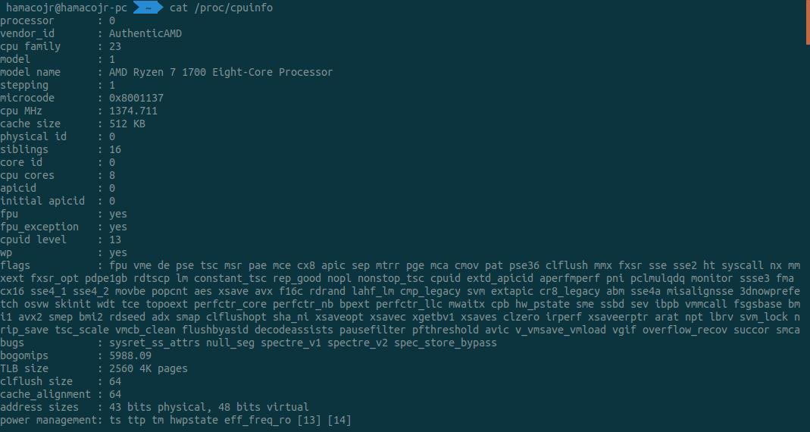

# Operating System Assignment 4

### 프로그램의 동작 과정

프로그램의 전체적인 구조는 간단하다. 무한루프를 돌며 사용자에게 입력을 받고, 해당 명령을 실행한다.

아래는 각 명령어의 순서도를 그린것이다.

- ls

  

- cd

  

- mkdir

  

- rmdir

  

- mkfile

  

- rmfile

  

- inode

  아래 순서도는 inode의 각 블락들의 개수를 계산하는 방법이다.

  

### 개발환경

- uname -a

  

- cpuinfo

  

- meminfo

  

### 과제 수행시 겪었던 어려움과 해결 방법

- `2018147580:/$
- 사용자의 입력을 파싱하는 과정이 쉽지 않았다. Regular expression을 사용해서 cd 명령어의 인자를 파싱하여 해결하였다.